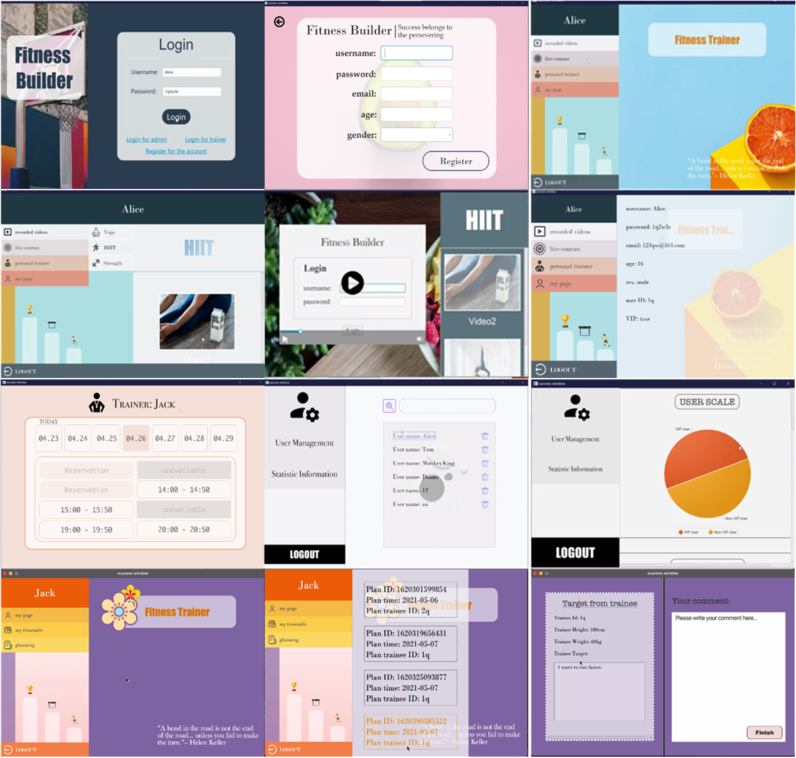

These course projects were completed in my undergraduate courses, covering various programming languages. I worked as a **designer** and **programmer** in all of them and accomplished most work.

* Fitness Builder Program (Java & JavaFX)

* Chinese Cuisine Website (JavaScript & CSS & HTML)

* FTP Server (C)

* Electronic Organ (C & Arduino)

* Telephone Management System (C)