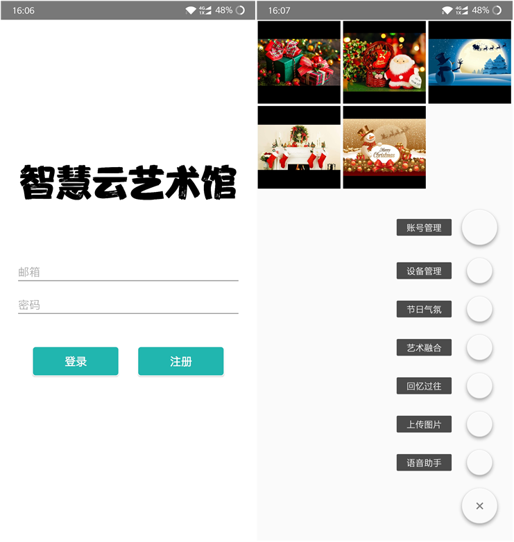

This project created a **digital photo album** that demonstrated photos, artworks, and dynamic images to users based on current environmental conditions, date, and user preferences and **matched music to pictures**, providing users with a diverse artistic perspective. The voice assistant answered questions about artworks and enabled users to control the photo album in voice.

* Participated in requirements analysis, system design, implementation and testing of developing the product.
* Developed the digital photo album on Raspberry Pi.
* Developed the Android app that allowed users to control the digital photo album via their smartphones.
